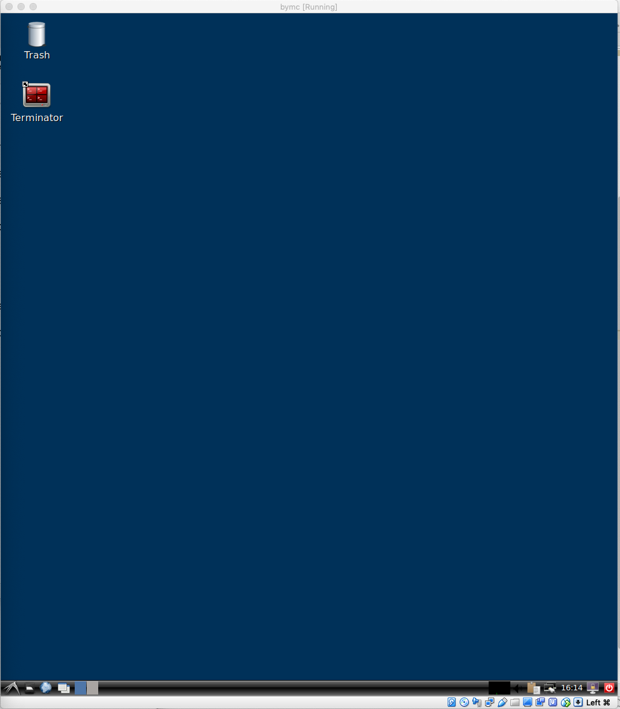
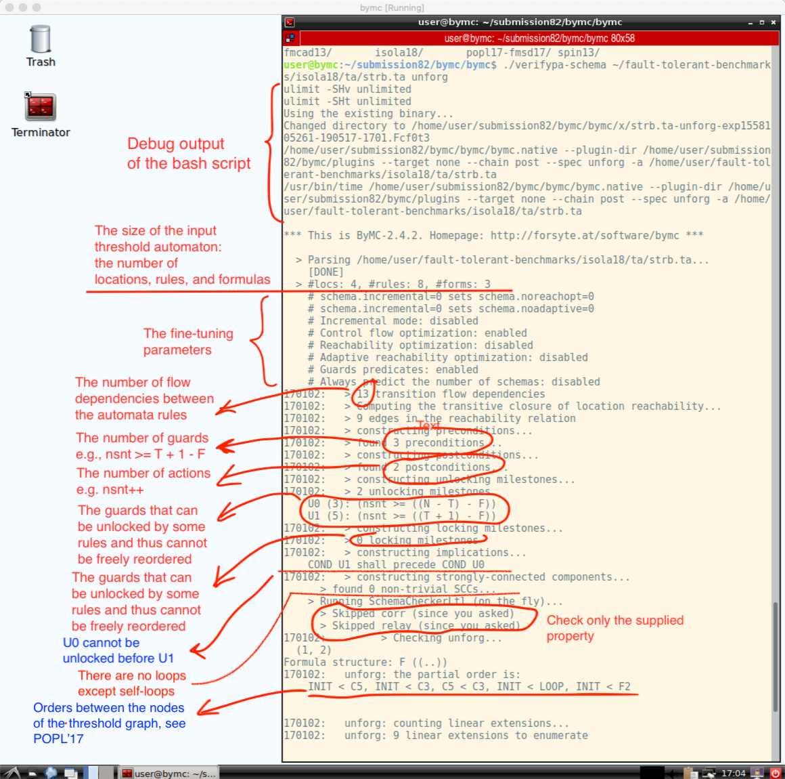

# ByMC: Byzantine Model Checker -- Tutorial

This tutorial presents the latest techniques that are implemented in version 2.4.2. We do not cover earlier techniques, which are also implemented in ByMC, as they are interesting only from the historical perspective. To get an overview of the input and the implemented techniques, read the [ISOLA18 paper](https://hal.inria.fr/hal-01909653/file/camera.pdf).

## Installation

There are two ways to install ByMC:

  1. Download a virtual machine from [the tool website](https://forsyte.at/software/bymc/). For instance, [download the latest version 2.4.2](http://forsyte.at/static/download/bymc-2.4.2.ova).  
  1. Download the sources from the [github repository](https://github.com/konnov/bymc), compile, and install the tool. Detailed instructions can be found in the [README](../README.md)
  
In this tutorial, we assume that you followed the easy path and downloaded the virtual machine. If you do not know how to install the virtual machine, check the [virtualbox instructions](https://docs.oracle.com/cd/E26217_01/E26796/html/qs-create-vm.html). After you have installed the virtual machine, run it and log in with the name `user` and password `user`. You should see a screen similar to this one:



## Examples

The benchmarks for all of our experiments are available from the [benchmarks repository](https://github.com/konnov/fault-tolerant-benchmarks). In this tutorial, we assume that you are using the [ISOLA18 benchmarks](https://github.com/konnov/fault-tolerant-benchmarks/tree/master/isola18), which are the latest benchmarks. ByMC supports two kinds of inputs:

 * **Parametric Promela**, which is a subset of [Spin's Promela](http://spinroot.com/spin/whatispin.html) extended with several parametric constructs. These files usually have the extension `pml`. For instance, check [strb.pml](https://github.com/konnov/fault-tolerant-benchmarks/blob/master/isola18/promela/strb.pml), which specifies reliable broadcast in Parametric Promela.
 
 * **Threshold automata**, which is the tool's internal language. These files usually have the extension `ta`. For instance, check [strb.ta](https://github.com/konnov/fault-tolerant-benchmarks/blob/master/isola18/ta/strb.ta), which specifies reliable broadcast as a threshold automaton.
 
 
### Which language do I choose?
 
 
  Parametric Promela allows you to model the number of received messages with a local counter such as `nrcvd` in [strb.pml](https://github.com/konnov/fault-tolerant-benchmarks/blob/master/isola18/promela/strb.pml). As a result, the specifications are somewhat closer to the original pseudo-code. Moreover, fairness constraints can be easily written in Parametric Promela. However, specifications in Parametric Promela require the tool to apply interval abstraction to the number of received messages. So it may happen that the tool cannot refine spurious counterexamples, which result from a too coarse abstraction. In this case, you can manually refine the abstraction domain.
  
  Threshold automata is the theoretical model of the techniques that are implemented in ByMC. As a result, it is easier to understand how the tool works when it is given a threshold automaton. However, it is more tedious to write threshold automata and fairness constraints. Nevertheless, we prefer to use threshold automata as a direct input to the tool.
 

  For a more detailed discussion on the topic, check the [ISOLA18 paper](https://hal.inria.fr/hal-01909653/file/camera.pdf).
 
## Running the tool
 
 In the virtual machine, open `Terminator` and execute the following commands:
 
```bash
$ cd submission82/bymc/bymc
$ ./verifypa-schema
```
 
 You should now see the list of the available options:
 
```
$ ./verifypa-schema 
Too few arguments (0 found, at least 2 expected): 

use ./verifypa-schema [switches] prog spec bymc_options
 where spec is one of those:
   * <spec> -- check only the specification with the name <spec>
   * all -- check all the available specifications
   * bounds -- compute the diameter bounds (as in the CONCUR'14 paper)

 and the switches are
  --limit-time: limit (in seconds) cpu time of subprocesses (ulimit -t)
  --limit-mem: limit (in MB) virtual memory of subprocesses (ulimit -v)
  -h|--help: show this help message

 bymc_options are as follows:
  -O schema.tech=ltl          (default, safety + liveness as in POPL'17)
  -O schema.tech=ltl-mpi      (parallel safety + liveness, EXPERIMENTAL)
  -O schema.tech=cav15        (reachability as in CAV'15)
  --smt 'lib2|z3|-smt2|-in'   (default, use z3 as the backend solver)
  --smt 'lib2|mysolver|arg1|arg2|arg3'  (use an SMT2 solver)
  --smt 'yices'               (use yices 1.x as the backend solver, DEPRECATED)
  -v               (verbose output, all debug messages get printed)

...
```

### Checking safety of a threshold automaton

Let's now check safety of reliable broadcast that is specified as a threshold automaton [strb.pml](https://github.com/konnov/fault-tolerant-benchmarks/blob/master/isola18/promela/strb.pml):

```bash
$ ./verifypa-schema ~/fault-tolerant-benchmarks/isola18/ta/strb.ta unforg

```
 
 The tool produces lots of detailed output. When the tool starts, it parses the input and outputs diagnostics about the input:
 
 
 
 Most importantly, the tool reports that it is about to check safety of 9 schemas. A precise definition of schemas and of the technique can be found in the [paper at POPL'17](http://dl.acm.org/citation.cfm?id=3009860).
 
 In the next screenshot, you can see that the tool enumerates 9 schemas. When analyzing one schema, it finds ordered sequences of rules and constructs constraints in the SMT solver.
 
 ")
 
*Inspecting SMT queries.* By default, ByMC is using Z3 via OCaml API. If you like to see the produced SMT constraints, run ByMC with the SMT-LIB mode as follows:
 
```
$ ./verifypa-schema ~/fault-tolerant-benchmarks/isola18/ta/strb.ta unforg --smt 'lib2|z3|-smt2|-in' -O smt.log=1
```
 
 If the command line version of `z3` is not available, install it by executing:
 
```bash
$ sudo apt-get update; sudo apt-get install z3
```
 
 The SMT files can be found in the directory `x/strb.ta-unforg*/`. The file `smt2schemaLtl_unforg.$i.log` contains the SMT queries for the ith schema.
 
### Checking liveness of a threshold automaton

This is done similar to safety:
 
 ```bash
 $ ./verifypa-schema ~/fault-tolerant-benchmarks/isola18/ta/strb.ta relay
 ```
 
 The output of the tool is similar to the safety case. However, the property `relay` is more complex and thus the tool produces a larger number of schemas (38 instead of 9).
 
### Inspecting counterexamples

The most interesting part about ByMC is that not only it can prove the properties, but it can also show counterexamples. To introduce a bug in reliable broadcast, change line 19 of strb.ta as follows:
 
 ```
   N >= 3T
 ```
 
 and run ByMC again:
 
 ```bash
 $ ./verifypa-schema ~/fault-tolerant-benchmarks/isola18/ta/strb.ta relay
 ```
 
 This time ByMC reports that it has found a counterexample to liveness:
 
 ```
    > SLPS: counterexample for relay found
 ```
 
The counterexample can be found in `cex-relay.trx`, which is well hidden in the directory `x/strb.ta-relay-*/`:

```bash
$ cat x/strb.ta-relay-*/cex-relay.trx
----------------
 Counterexample
----------------
           
 N := 18; T := 6; F := 6;
   0 (F   0) x 0:  nsnt := 0; K[pc:0] := 11; K[pc:1] := 1; K[*] := 0;
   1 (F   2) x 1:  nsnt := 1; K[pc:1] := 0; K[pc:2] := 1;
   2 (F   4) x 4:  nsnt := 5; K[pc:0] := 7; K[pc:2] := 5;
   3 (F   6) x 1:  nsnt := 6; K[pc:0] := 6; K[pc:2] := 6;
   4 (F  11) x 1:  K[pc:2] := 5; K[pc:3] := 1;
   5 (F  16) x 1:  K[pc:2] := 4; K[pc:3] := 2;
   6 (F  21) x 1:  K[pc:2] := 3; K[pc:3] := 3;
   7 (F  24) x 1:  K[pc:2] := 2; K[pc:3] := 4;
****************
 nsnt := 6; K[pc:0] := 6; K[pc:1] := 0; K[pc:2] := 2; K[pc:3] := 4;

****** LOOP *******
 N := 18; T := 6; F := 6;
   8 (F  27) x 1:  K[pc:2] := 1; K[pc:3] := 5;
   9 (F  29) x 1:  <self-loop>
****************
 K[pc:2] := 1; K[pc:3] := 5;

 Gute Nacht. Spokoinoy nochi. Laku noch.
```
 
 In the first line, the values of the parameters are given: `N=18`, `T=6`, `F=6`.
 That is, there are 18 processes, up to 6 of them are faulty. Then, for each state, the counterexample shows the values of the variables that have changed: the value of the counter `nsnt` and the values of the counters for the updated locations, e.g., `K[pc:1]=1` tells us that there is one process in the location with `pc=1`. The multipliers `... x 1` and `... x 4` show that 1 process and 4 processes executed the step, respectively.
 
 The steps between the lines `****** LOOP ******` and `************` show the loop of the discovered lasso. Since it is a counterexample to liveness, it has the shape of a lasso. In case of safety, there will be no loop part.
 
 ### Checking safety and liveness of Parametric Promela code
 
 To verify a threshold-guarded distributed algorithm in Parametric Promela, one runs ByMC similar to the case of threshold automata:

 ```bash
 $ ./verifypa-schema ~/fault-tolerant-benchmarks/isola18/promela/strb.pml relay

 ```
 
 ")
 
 
 
 

